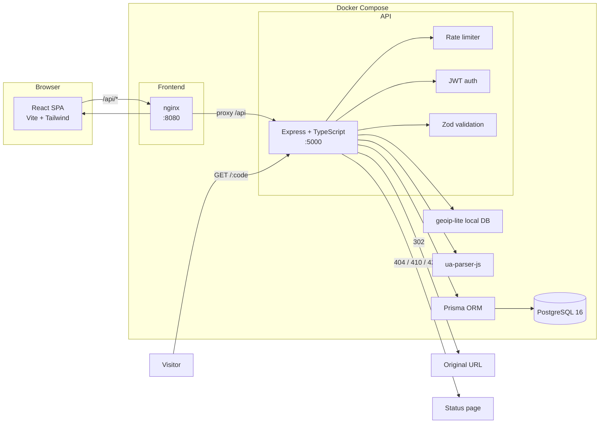
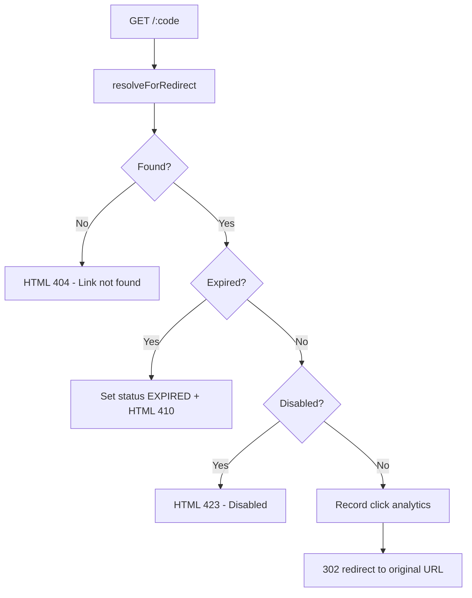
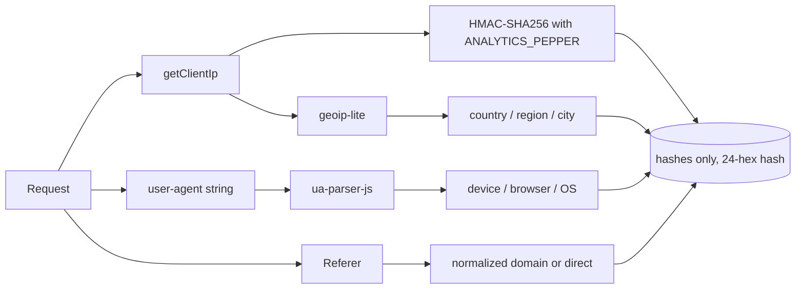

<p align="center">
  
</p>

<h1 align="center">LinkForge</h1>

<p align="center">
  Short links, branded QR codes, and real-time click analytics in one self-hosted app.
</p>

<p align="center">
  <b>React 18</b> · <b>TypeScript</b> · <b>Tailwind CSS</b> · <b>Express</b> · <b>Prisma</b> · <b>PostgreSQL</b> · <b>Docker</b>
</p>

LinkForge is a production-style URL shortener. Paste a long URL, get a short link, generate a
brandable QR code, and track exactly who is clicking — devices, browsers, operating systems,
countries, and referrers — all with privacy-minded analytics.

## Features

- **Short links without friction** — shorten any URL instantly, even as a guest.
- **Custom aliases** — choose a memorable alias (`linkforge.dev/get-started`), with reserved-route protection
  and collision checks against existing short codes.
- **Expiring & disposable links** — set a first expiry; links lazily transition to `EXPIRED` (HTTP 410)
  and can be disabled any time (HTTP 423).
- **QR Studio** — per-link QR settings (colors, size, quiet zone, optional centered logo) rendered live in
  the browser; download crisp **PNG** or vector **SVG**.
- **Click analytics** — summary counters plus daily click series and top-10 breakdowns by device, browser,
  OS, country, and referrer.
- **Account dashboard** — JWT auth in an httpOnly cookie, link management with search/filter/sort/pagination,
  profile editing, and password reset.
- **Privacy by design** — visitor IPs are one-way hashed with a server-side pepper, full user-agents are
  classified into categories and discarded, and referrers are reduced to their domain.
- **Dockerized** — one `docker compose up` runs Postgres, the API, and the nginx-served frontend.

## Architecture



Route resolution flow for a short link:



## Repository layout

```
.
├── client/                 # React single-page application
│   ├── src/
│   │   ├── components/     # UI kit, layouts, ShortenForm, dashboard shell
│   │   ├── context/        # AuthProvider (session via /auth/me)
│   │   ├── lib/            # API client, QR renderer, formatters
│   │   └── pages/          # Landing, auth, dashboard, error pages
│   ├── Dockerfile          # Multi-stage build -> nginx
│   └── nginx.conf          # SPA fallback + /api proxy to backend
├── server/                 # Express + TypeScript API
│   ├── prisma/             # Schema, migrations, seed script
│   ├── src/
│   │   ├── config/         # Env validation, Prisma client
│   │   ├── controllers/    # Thin HTTP handlers
│   │   ├── middleware/     # Auth, validation, rate limiting, errors
│   │   ├── routes/         # Express routers
│   │   ├── schemas/        # Zod request schemas
│   │   ├── services/       # Domain logic
│   │   └── utils/          # Logging, geo, user-agent, IP hashing
│   ├── tests/              # Vitest + Supertest integration tests
│   └── Dockerfile          # Multi-stage build + migrate on start
├── docker-compose.yml
└── .env.example
```

## Getting started

### Prerequisites

- Docker + Docker Compose (fastest path), **or**
- Node.js 20+, npm, and a reachable PostgreSQL 16 database.

### Option A — Docker Compose (recommended)

```bash
cp .env.example .env      # then edit JWT_SECRET and ANALYTICS_PEPPER
docker compose up --build
```

- Frontend: http://localhost:8080
- API: http://localhost:5000
- Health check: http://localhost:5000/health

Migrations run automatically when the backend container starts. To load demo data:

```bash
docker compose exec backend npm run seed
# Demo account: demo@linkforge.dev / linkforge123
```

### Option B — Local development

```bash
# 1. Start PostgreSQL (Docker)
docker run --name linkforge-postgres -e POSTGRES_USER=linkforge \
  -e POSTGRES_PASSWORD=linkforge -e POSTGRES_DB=linkforge \
  -p 5432:5432 -d postgres:16-alpine

# 2. Backend
cd server
cp .env.example .env
npm install
npx prisma migrate deploy
npm run seed        # optional demo data
npm run dev         # http://localhost:5000

# 3. Frontend (new terminal)
cd client
cp .env.example .env
npm install
npm run dev         # http://localhost:5173 (proxies /api to :5000)
```

In development the Vite server proxies `/api` and `/health` to the backend, and cookies are scoped to
`localhost`, so no CORS ceremony is needed.

## Configuration

The backend validates its environment at startup with Zod — missing or malformed values fail fast.

| Variable | Default | Description |
| --- | --- | --- |
| `DATABASE_URL` | — | PostgreSQL connection string |
| `PORT` | `5000` | API port |
| `JWT_SECRET` | — | Signing secret for auth tokens (required) |
| `JWT_EXPIRES_IN` | `7d` | Access token lifetime |
| `ACCESS_COOKIE_NAME` | `linkforge_token` | Auth cookie name |
| `CORS_ORIGINS` | `http://localhost:5173` | Allowed origins (comma separated) |
| `BASE_URL` | `http://localhost:5000` | Public base used to build short URLs / QR content |
| `APP_URL` | `http://localhost:5173` | Public app URL (used in reset emails) |
| `RATE_LIMIT_WINDOW_MS` | `900000` | Generic rate-limit window |
| `RATE_LIMIT_MAX_REQUESTS` | `100` | Generic max requests per window |
| `GUEST_LINK_LIMIT_PER_HOUR` | `10` | Guest link-creation cap |
| `USER_LINK_LIMIT_PER_HOUR` | `100` | Authenticated link-creation cap |
| `GUEST_LINK_TTL_MS` | `604800000` | Guest links expire after 7 days |
| `ANALYTICS_PEPPER` | — | Pepper for IP hashing (required) |
| `SMTP_HOST` / `SMTP_USER` / `SMTP_PASS` / `SMTP_FROM` | — | For password-reset emails |

**Note on password reset:** when `SMTP_HOST` is empty and `NODE_ENV !== 'production'`, the reset link is
returned in the API response for convenient local testing. In production, configure SMTP and the link is
only emailed.

## API reference

All responses use the envelope `{ success, data }`; errors use
`{ success: false, error: { code, message, details? } }`. Authenticated endpoints accept the JWT via the
`linkforge_token` httpOnly cookie.

### Auth (`/api/auth`)

| Method | Route | Body / Query | Description |
| --- | --- | --- | --- |
| POST | `/register` | `{ name, email, password }` | Create account + set cookie |
| POST | `/login` | `{ email, password }` | Sign in + set cookie |
| POST | `/logout` | — | Clear cookie |
| GET | `/me` | — | Current user |
| POST | `/forgot-password` | `{ email }` | Send reset link (rate limited) |
| POST | `/reset-password` | `{ token, password }` | Apply new password |
| POST | `/change-password` | `{ currentPassword, newPassword }` | Change password (authed) |
| PUT | `/profile` | `{ name, email }` | Update profile (authed) |

### Links (`/api/links`)

| Method | Route | Body / Query | Description |
| --- | --- | --- | --- |
| POST | `/` | `{ originalUrl, customAlias?, title?, expiresAt? }` | Create link (guests allowed; rate limited) |
| GET | `/` | `page, limit, search, status, sortBy, order` | List my links (paged) |
| GET | `/:id` | — | Get one link |
| PUT | `/:id` | `{ originalUrl?, customAlias?, title?, expiresAt? }` | Update link |
| DELETE | `/:id` | — | Delete link + clicks + QR settings |
| POST | `/:id/disable` | — | Set status `DISABLED` |
| POST | `/:id/enable` | — | Set status `ACTIVE` |

### Analytics (`/api/links/:id/analytics`)

| Method | Route | Description |
| --- | --- | --- |
| GET | `/summary` | `totalClicks`, `uniqueVisitors`, `todayClicks`, `last7DaysClicks` |
| GET | `/clicks?days=7\|14\|30\|90` | Daily-click series (zero-filled) |
| GET | `/devices` · `/browsers` · `/operating-systems` | Share (%) top-10 breakdowns |
| GET | `/countries` · `/referrers` | Share (%) top-10 breakdowns |

### QR codes (`/api/links/:id/qr`)

| Method | Route | Body | Description |
| --- | --- | --- | --- |
| GET | `/` | — | Get saved settings |
| PUT | `/` | `{ foregroundColor, backgroundColor, size, margin, logoUrl? }` | Save settings (values clamped) |

### Redirect (`/:code`)

`GET /:code` is unauthenticated: **302** to the destination, **404** / **410** / **423** HTML pages for
missing / expired / disabled links. Expired links are lazy-updated to `status = 'EXPIRED'`.

## Analytics & privacy

Visits are recorded only for successful (active) redirects:



Raw IPs and full user-agent strings are never persisted.

## Testing

```bash
# Backend integration tests (uses Dockerized PostgreSQL)
cd server
npx vitest run        # 49 tests: auth, links, redirect, analytics, QR, rate limiting

# Type checks and lint
cd server && npm run typecheck && npm run lint
cd client && npm run typecheck && npm run build
```

## Scripts

| Directory | Script | Purpose |
| --- | --- | --- |
| `server` | `npm run dev` | Hot-reload dev server (tsx watch) |
| `server` | `npm run build` | Compile to `dist/` |
| `server` | `npm run start` | Run compiled app |
| `server` | `npm test` | Vitest suite |
| `server` | `npm run seed` | Load demo account + ~7.5k clicks |
| `server` | `npm run migrate:deploy` | Apply Prisma migrations |
| `client` | `npm run dev` | Vite dev server (`:5173`) |
| `client` | `npm run build` | Type-check + production bundle |

## Roadmap

- Team workspaces with shared link namespaces
- QR-in-bulk generation and CSV export
- Custom domains for short links
- Referrer- and campaign-based analytics filters

## License

[MIT](LICENSE)
